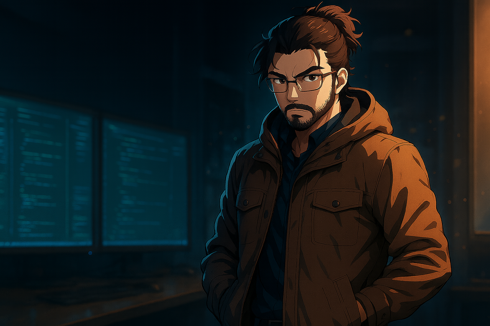

<p align="center">
  
</p>

<h1 align="center">Carlos Takushi Rocha</h1>

<p align="center">
  Fullstack Developer · C# | Node.js | Vue | React <br/>
  UI & UX apaixonado por performance, arquitetura e design <br/>
  Osasco/SP — Disponível remoto
</p>

<p align="center">
  <a href="mailto:sou.carlos@outlook.com"></a>
  <a href="https://www.linkedin.com/in/soucarlosrocha" target="_blank"></a>
</p>

---

## 🚀 Tech Stack

```js
Frontend:   React · Vue · Next.js · Vite
Estilo:     MUI · Styled Components
Backend:    C# · Node.js · Express
Estado:     Redux · Pinia · Context API
Outros:     Git · Docker · Swagger · Jest · GraphQL
